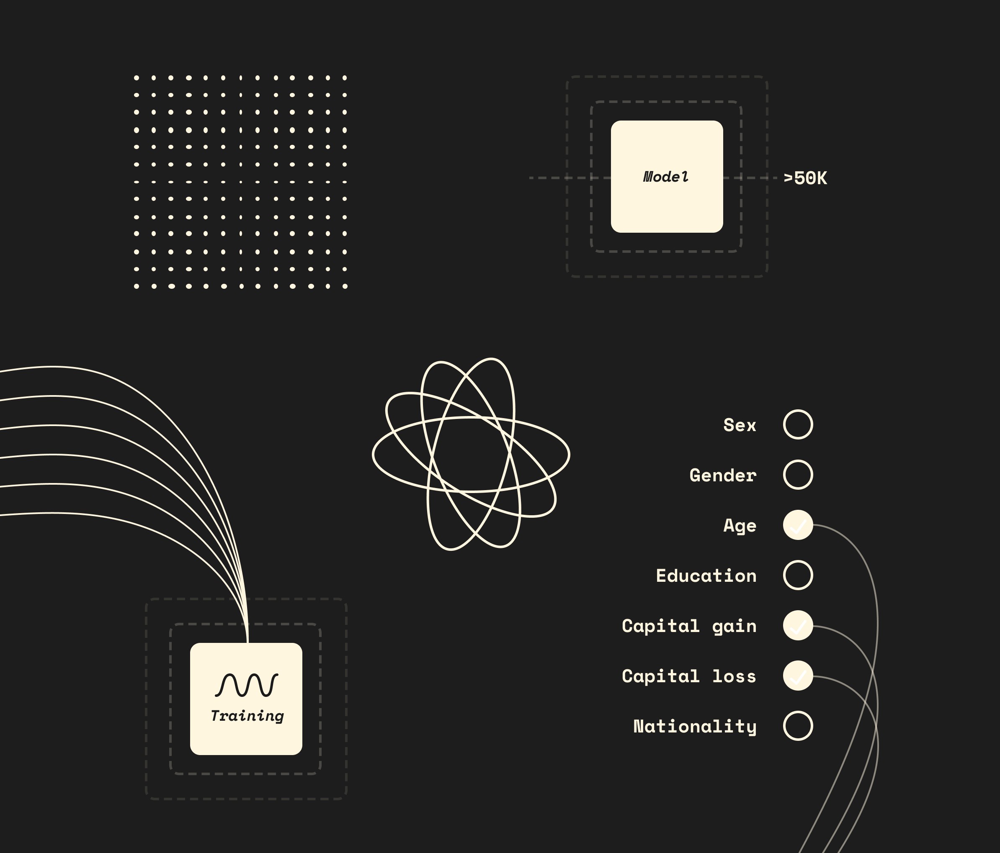

# (Un)Fair Machine



(Un)Fair Machine is an interactive web series about Machine Learning Fairness, specifically the conceptions of fairness that have been proposed. [You can view here](https://unfair-machine.vuluong.me/).

## Instructions

In the project directory, you can run:

```
npm install
gatsby develop
```

Then the app will be availabe at [http://localhost:8000](http://localhost:8000).
